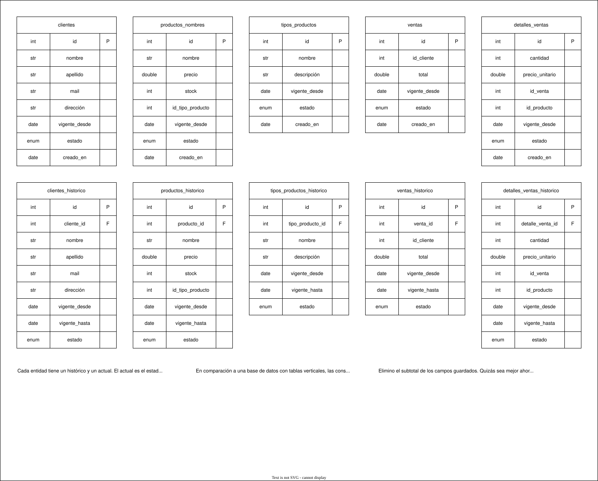

# Arquitectura de la base de datos

Se decidió transicionar el proyecto orientándolo a una base de
datos con almacenamiento histórico de los datos, implementando
bajas y actualizaciones lógicas. A continuación, la siguiente
imagen muestra las tablas de la misma, con algunos comentarios.

